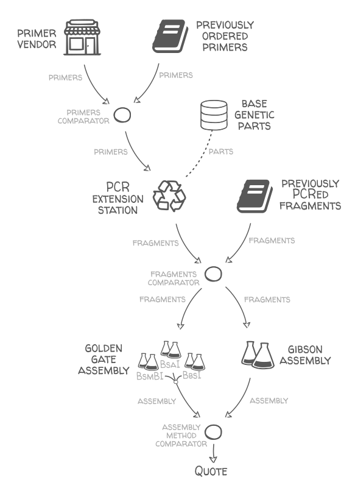

# galaxy_synbioCAD_dnaweaver

[](https://travis-ci.org/Edinburgh-Genome-Foundry/galaxy_synbiocad_dnaweaver)

## Installing/Dockerizing

This is not yet dockerized but as per the .travisyml file the Docker build (from an ubuntu/python image) should be:

```
sudo apt-get -qq update
sudo apt-get install ncbi-blast+
pip install -r requirements.txt
```

## Running the script

See ``script.py`` or run ``./script.py -h`` for the description of the parameters.
The typical example is:

```
script.py input_sbol.xml output.xlsx any_method
```

Where ``input_sbol.xml`` is a path to an .xml SBOL file containing constructs designs and sequences, ``output.xlsx`` is a spreadsheet report of the assembly
plan, and ``any_method`` (which can also be only ``gibson`` or ``golden_gate``)
indicates to consider both methods.

## Testing

The .travis.yml file describes the testing procedure. To run the test install pytest:

```
pip install pytest
```

Then run the tests with:

```
python3 -m pytest tests.py
```

## What this program does

**Problem:**

Given a set of designs (one design is a construct name and list of
its parts), find a valid and efficient assembly plan to build all the designs.
The designs and part sequences are provided as an SBOL file
(see ``test_input.xml`` for an example)

**Method:**

- We assume that the different standard parts are available or will be ordered,
  with the exact sequence provided in the input file (in the future it would be easy to automatically break long parts into smaller fragments).
- The desired construct sequence for a design is simply the contenation of that design's part sequences in the right order (no assembly overhang is included).
- Buy primers with overhangs to extend the parts fragments via PCR and create   homologies between them so they can be assembled together.
- Assemble each construct in a single step with Golden Gate assembly if possible (that is if at least one site out of BsaI, BbsI and BsmBI is totally absent from the construct sequence), else with Gibson assembly. It can also be only one of the two methods if the option ``gibson`` or ``golden_gate`` is selected instead of ``any_method``.
- Start with the first design, and for each subsequence design assembly plan   reuse the primers ordered and fragments PCRed in previous designs, if   relevant.

Here is a schema of the supply network used:


<p align="center"></p>

**Output:**

See ``example_output.xlsx`` for an example. The output is an Excel spreadsheet with the following sub-sheets:

- ``construct_parts``: the ID and list of part names (in the right order) for each design.
- ``construct_sequences``: the final sequence of the constructs to build.
- ``part_sequences``: the list of each standard part and its sequence (same information as in the input SBOL file).
- ``fragment_extensions``: for each PCR fragment, the standard part and the primers to use
- ``assembly_plan``: for each design, the list of PCR fragments to use. 
- ``errors``: list of errors to help troubleshooting assemblies for which no valid assembly plan was found.

## Description of the example/testing sample

The example input SBOL is from an example file provided by @pablocarb, with a random sequence used for the terminator (Ter) part. The example has 48 designs which are well representative. Some have type-2s sites preventing golden gate, some use the same part more than once, making it a challenging scenario for scarless Golden Gate assembly.

The output ``example_output.xlsx`` shows the plan generated to build all the designs. The plan has:

- 19 different base parts (provided by the SBOL input)
- 125 primers to be ordered to extend the parts in various ways (that's less than 3 primers per design to build, thanks to primer reuse)
- 116 fragments to be PCRed (less than 3 PCRs per design to build, thanks to fragment reuse).
- 15 designs seem to need Gibson assembly as they contain BsaI, BsmBI, and BbsI sites, the rest use Golden Gate assembly. 

## Limitations

For constructs with repeated parts and other homologies (such as, in the example, the designs with several "Ter" in a row, ), Gibson assembly (and probably LCR assembly too) may create misanealled constructs and more clones will need to be picked. This is not taken into account by the script at the moment. This could be fixed by buying custom fragments from a commercial vendor for the extreme cases (i.e. by amending the current implementation to forbid gibson cuts in regions with homologies elsewhere, and add a DNA vendor in the supply network).

## Code organisation

- ``script.py`` -- main script, can be run from the command line
- ``methods/generate_supply_network.py`` -- implements the DnaWeaver supply network from the figure above.
- ``methods/compute_all_constructs.py`` -- main loop to iterate over all constructs and get assembly plans using the supply network.
- ``methods/write_output_spreadsheet.py`` -- method to write the data collected into the output spreadsheet.